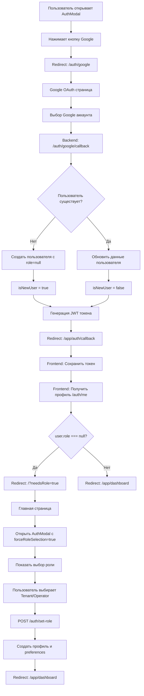

# Google OAuth Flow с выбором роли

## 📊 Визуальный поток для нового пользователя



## 🔑 Ключевые моменты

### 1. **Клик на кнопку Google в AuthModal**

```javascript
handleGoogleAuth = () => {
  window.location.href = `${NEXT_PUBLIC_API_URL}/auth/google`;
};
```

### 2. **Backend создает пользователя без роли**

```javascript
// auth.service.ts - googleAuth()
if (!user) {
  user = this.userRepository.create({
    email: email.toLowerCase(),
    google_id,
    full_name,
    avatar_url,
    role: null, // ← Ключевой момент!
    status: "active",
  });
}
```

### 3. **Frontend проверяет роль**

```javascript
// auth/callback/page.tsx
if (!user.role) {
  router.replace("/?needsRole=true");
}
```

### 4. **Главная страница показывает выбор роли**

```javascript
// page.tsx
if (needsRole === "true") {
  setNeedsRoleSelection(true);
  setAuthModalOpen(true);
}
```

### 5. **AuthModal в режиме выбора роли**

```javascript
// AuthModal.tsx
if (forceRoleSelection && isOpen) {
  setStep("role");
  setRequiresRegistration(true);
}
```

### 6. **Установка роли через API**

```javascript
// При выборе роли
if (isOAuthRoleSelection) {
  const response = await authAPI.setRole(selectedRole);
}
```

## 🚨 Критические точки проверки

1. **Role column должна быть nullable**

   - Миграция должна быть применена
   - `ALTER TABLE users ALTER COLUMN role DROP NOT NULL`

2. **Backend не должен автоматически устанавливать роль**

   - Проверить, что `role: null` при создании

3. **Frontend должен корректно обрабатывать пользователей без роли**

   - AuthModal не должен закрываться для OAuth роли
   - Должен показываться экран выбора роли

4. **API setRole должен работать**
   - Создавать соответствующий профиль
   - Обновлять пользователя в Redux

## 🧪 Тестовый сценарий

1. Очистить localStorage
2. Открыть AuthModal
3. Нажать на кнопку Google
4. Войти с новым email
5. Должен показаться выбор роли
6. Выбрать Tenant или Operator
7. Должен создаться профиль
8. Перенаправление на dashboard
