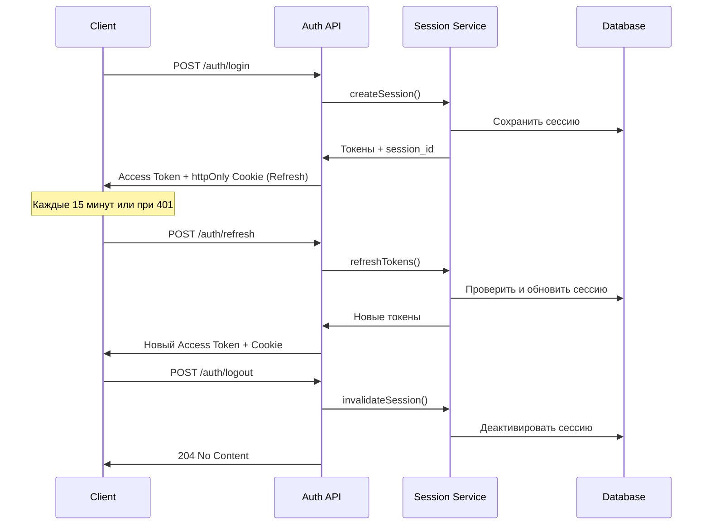

# Система безопасности TaDa

## Обзор

Реализована продвинутая и защищенная система управления сессиями пользователей с множественными уровнями безопасности.

## Основные функции безопасности

### 1. 🔐 Двухтокенная аутентификация

- **Access Token**: Короткоживущий (15 минут), хранится в sessionStorage
- **Refresh Token**: Долгоживущий (7 дней), хранится в httpOnly cookies
- Автоматическое обновление токенов без прерывания пользовательского опыта

### 2. 🖥️ Device Fingerprinting

- Уникальная идентификация устройства на основе:
  - User Agent
  - Языковые настройки
  - Разрешение экрана
  - Canvas fingerprint
  - Часовой пояс
- Привязка сессий к устройствам для предотвращения несанкционированного доступа

### 3. 📊 Управление сессиями

- Отслеживание активных сессий пользователя
- Ограничение: максимум 3 сессии на устройство
- Возможность завершения отдельных сессий или всех сразу
- Автоматическая очистка истекших и неактивных сессий

### 4. 🔒 Безопасное хранение

- Access токены в sessionStorage (автоматически очищаются при закрытии браузера)
- Refresh токены в httpOnly cookies (недоступны для JavaScript)
- Защита от XSS и CSRF атак

### 5. 📈 Мониторинг активности

- Отслеживание последней активности пользователя
- Автоматическое обновление активности при взаимодействии
- Завершение неактивных сессий через 30 дней

## Архитектура

### Backend (NestJS)

#### Новые компоненты:

- `SessionService` - управление сессиями пользователей
- `SessionCleanupService` - автоматическая очистка истекших сессий
- `Session` entity - модель данных сессии
- Обновленный `AuthService` - интеграция с системой сессий
- Обновленный `JwtStrategy` - проверка активности сессий

#### API Endpoints:

```
POST /auth/login      - Вход с созданием сессии
POST /auth/register   - Регистрация с созданием сессии
POST /auth/refresh    - Обновление токенов
POST /auth/logout     - Выход из текущей сессии
POST /auth/logout-all - Выход из всех сессий
POST /auth/logout-others - Выход из других сессий
GET  /auth/sessions   - Получение активных сессий
DELETE /auth/sessions/:id - Завершение конкретной сессии
POST /auth/activity   - Обновление активности сессии
```

### Frontend (Next.js + Redux)

#### Новые компоненты:

- Обновленный `authSlice` - управление состоянием аутентификации
- Обновленный API клиент - автоматическое обновление токенов
- `SessionManager` - компонент управления сессиями
- Страница `/security` - интерфейс управления безопасностью
- `SessionInitializer` - инициализация сессии при загрузке

#### Ключевые функции:

- Автоматическое восстановление сессии при загрузке
- Проактивное обновление токенов за 2 минуты до истечения
- Отслеживание активности пользователя
- Интерцепторы для обработки истекших токенов

## База данных

### Таблица Sessions

```sql
CREATE TABLE sessions (
    id UUID PRIMARY KEY,
    user_id UUID NOT NULL REFERENCES users(id) ON DELETE CASCADE,
    refresh_token VARCHAR(500) UNIQUE NOT NULL,
    session_id VARCHAR(100) UNIQUE NOT NULL,
    device_fingerprint VARCHAR(255) NOT NULL,
    device_name VARCHAR(100),
    ip_address INET,
    user_agent TEXT,
    expires_at TIMESTAMP NOT NULL,
    last_activity TIMESTAMP,
    is_active BOOLEAN DEFAULT true,
    created_at TIMESTAMP DEFAULT CURRENT_TIMESTAMP,
    updated_at TIMESTAMP DEFAULT CURRENT_TIMESTAMP
);
```

### Индексы для производительности:

- `user_id` - для быстрого поиска сессий пользователя
- `refresh_token` - для валидации refresh токенов
- `session_id` - для поиска по ID сессии
- `expires_at` - для очистки истекших сессий
- `device_fingerprint` - для поиска по устройству

## Переменные окружения

### Backend (.env)

```env
# JWT Configuration
JWT_SECRET=your-super-secret-jwt-key-change-this-in-production
JWT_ACCESS_EXPIRES_IN=15m
JWT_REFRESH_EXPIRES_IN=7d

# Security Configuration
BCRYPT_ROUNDS=12
SESSION_CLEANUP_INTERVAL=1h
MAX_SESSIONS_PER_DEVICE=3
```

## Безопасность в производстве

### Обязательные настройки:

1. **JWT Secret**: Используйте криптографически стойкий ключ
2. **HTTPS**: Обязательно для httpOnly cookies
3. **CORS**: Настройте только для доверенных доменов
4. **Rate Limiting**: Ограничьте попытки входа
5. **Мониторинг**: Отслеживайте подозрительную активность

### Рекомендации:

- Регулярно ротируйте JWT секреты
- Мониторьте количество активных сессий
- Настройте алерты на необычную активность
- Используйте централизованное логирование
- Регулярно обновляйте зависимости

## Использование

### Для пользователей:

1. **Проверка сессий**: Переходите в настройки безопасности
2. **Завершение сессий**: Завершайте подозрительные сессии
3. **Мониторинг**: Следите за списком активных устройств

### Для разработчиков:

1. **Автоматическое обновление токенов**: Реализовано прозрачно
2. **Обработка ошибок**: 401 ошибки автоматически обрабатываются
3. **Состояние аутентификации**: Доступно через Redux store

## Диаграмма потока аутентификации



## Мониторинг и логирование

### Ключевые метрики:

- Количество активных сессий
- Частота обновления токенов
- Подозрительная активность (множественные устройства)
- Производительность очистки сессий

### Логируемые события:

- Создание/завершение сессий
- Обновление токенов
- Подозрительная активность
- Ошибки аутентификации

## Миграция с текущей системы

1. **Запуск миграции**: `npm run typeorm:migration:run`
2. **Обновление frontend**: Новые компоненты автоматически активируются
3. **Переходный период**: Старые токены остаются действительными
4. **Полный переход**: После перелогина всех пользователей

## Troubleshooting

### Проблемы с токенами:

- Проверьте время системы (JWT чувствителен к времени)
- Убедитесь в правильности JWT_SECRET
- Проверьте CORS настройки для cookies

### Проблемы с сессиями:

- Проверьте подключение к базе данных
- Убедитесь, что миграции применены
- Проверьте логи очистки сессий

### Производительность:

- Мониторьте размер таблицы sessions
- Настройте индексы согласно нагрузке
- Рассмотрите использование Redis для сессий в высоконагруженных системах
